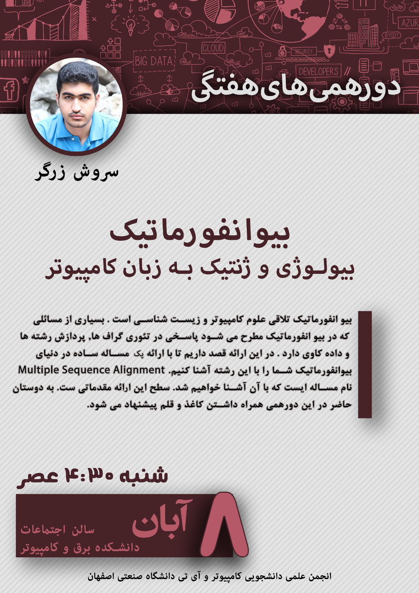

# Dorehami Week 2 - Bioinformatics

### Bioinformatics: Biology & Genetics in the Language of Computers
- Speaker: [Soroush Zargar](https://www.linkedin.com/in/soroushzargar): Software Engineering Student @ IUT, 2013 - Present
- Date: 2016 Oct 29 (1395 Aban 8)
- [Presentation Link (PDF)]()
- [Presentation Link (Power Point Slide Show)](bioinformatics.pptx)

[View the poster in higher resolution](SoroushZargar-Bio.jpg)
