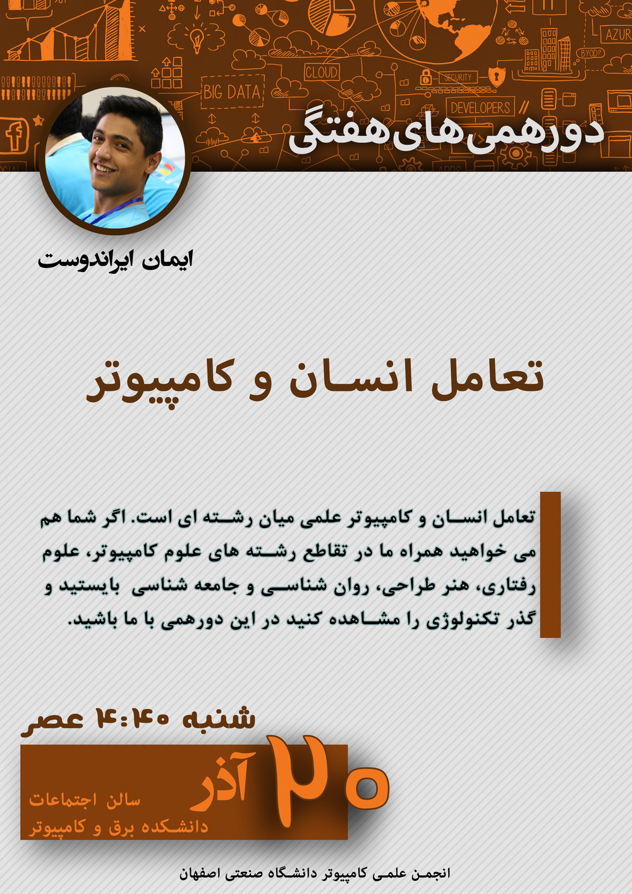

# Dorehami Week 4 - HCI

### HCI: Human-Computer Interaction
- Speaker: [Iman Irandoost](http://imnirdst.github.io/): Software Engineering Student @ IUT, 2012 - Present
- Date: 2016 Dec 10 (1395 Azar 20)
- [Presentation Link](http://imnirdst.github.io/Intro-to-HCI)

[View the poster in higher resolution](ImanIrandoost-HCI.jpg)
